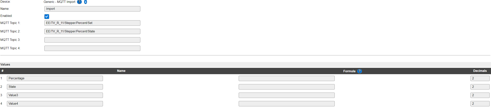
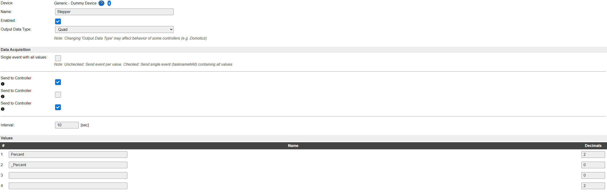
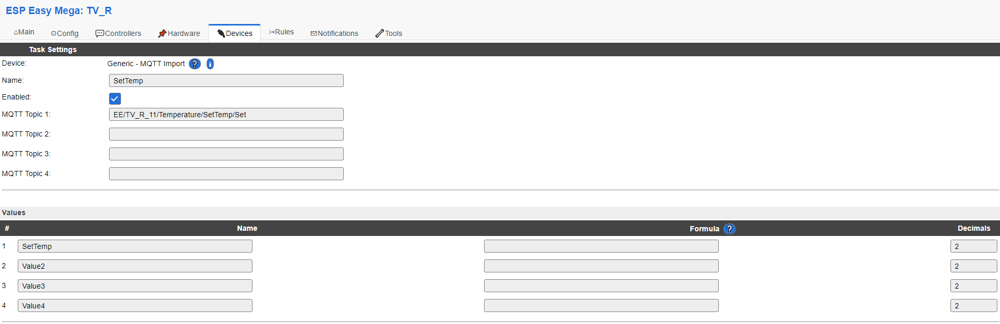
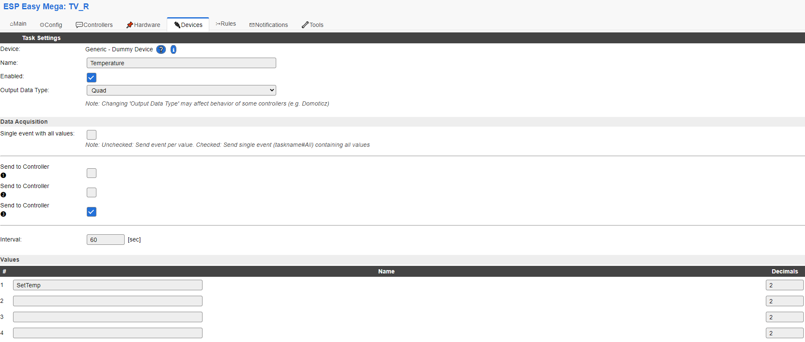

# NodeRED_ESPEASY_AutoDiscovery  
[Start](README.md)  
[Main Install](MainInstall.md)<!--[Start](Readme.md)  -->  
[Advance Settings](Advance.md)  

**MQTT Import info:**  
if MQTT import is needed to be used then the first MQTT controller needs to have no username or password and be disabled

# Devices:

## Sensorer:
You only need to activate the device and set it to use the HA controller:


## Switch:
create a dummy device and set the name of a value to include "Relay" or "Switch" as default  

add a new rule with the name Set%tskname% (exampel SetRelay if value is Relay)   
this rules job is to set the dummydevice and if needed GPIO  
Exampel:  
```
on SetRelay do
 taskvalueset,3,1,%eventvalue%
endon
```

## Dimmer:
1. Create a dummy device 
2. Set a name of a value to include "Percent" or "Brightness"
3. Set one more to with prefix "_" example "_Percent" and set it to 0 Decimals
3. Create a MQTT import device
4. Set a name to the same as step 2 and one to State
5. set 1 Topic to the topic that step2 creates and add /Set
6. do the same for topic 2 but with /State
7. Add rules to copy values between them and run task if command is recived  

(Exampel image both Devices)  
**MQTT Import**  

**Dummy Device**  

```
on Import#Percentage do
 taskvalueset,2,1,%eventvalue%
 taskrun,2
endon
on Import#State do
 taskvalueset,2,2,[Import#State]
 if [Import#State]=1 then
  taskvalueset,2,1,[Import#Percentage]
 else
  taskvalueset,2,1,0
 endif
 taskrun,2
endon
```
## RGBDimmer
1. Do all 7 Steps from Dimmer but in step 2 set the name to "RGBBrightness"
2. Add an secound MQTT import device
3. set the names to "R","G","B" and topic to MQTT topic of RGBBrightness and add "/_R","/_G","/_B"


## Termostat 
1. Create a dummy device 
2. Set a name of a value to include "SetTemp" or "SetTime"  
(different settings of max and min temp as default  
this variable is the shown temperature in big at the Termostat)
3. Create a MQTT Device
4. Set one variable to the same name as in step 2
5. if needed set one more to SetMode
6. Set first topic to Dummy devices topic and add /Set
7. if Step 5 is done  set next as step 6 but with sufix /FanMode

**MQTT Import**  
  
**Dummy Device**  
  
