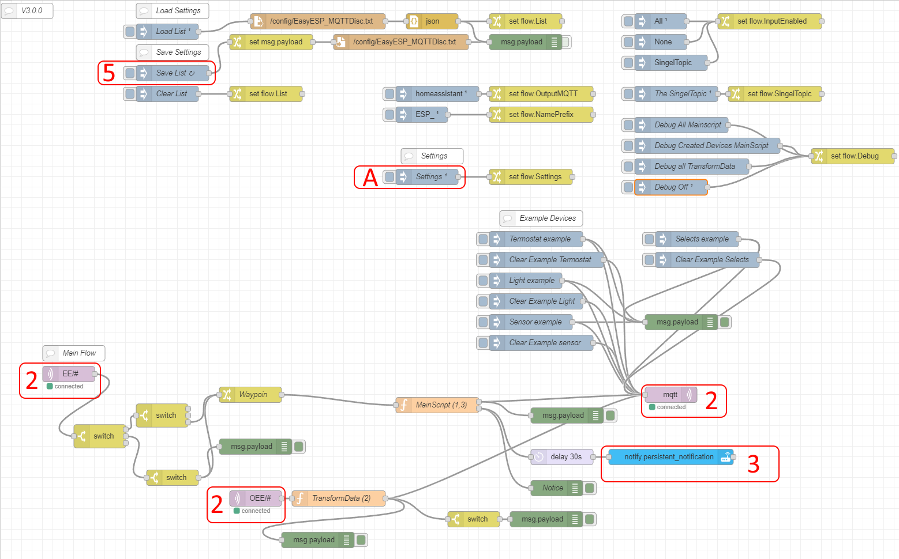

# NodeRED_ESPEASY_AutoDiscovery
[Start](README.md)  
[Device Install](Devices.md)  
[Advance Settings](Advance.md)  

# Install Node-Red Flow  
1. Copy [MQTTDiscovery.json](MQTTDiscovery.json) and import in Node-Red
2. Change/Update the MQTT nodes with correct security and other settings
3. Update Node with connection to homeassistant if not in same container(HA Plugin)
4. Deploy it
* Until Save list is clicked an error will be shown when deloying  
 "Error: ENOENT: no such file or directory, open '/config/EasyESP_MQTTDisc.txt'" (file not found)
5. Run inject button Save List to create a starting point.    

**A.** Contains Settings that can be changed if nessesery se Advance Settings

# EasyESP: 
# !Home assistant do only support A-Z,_,0-9 in any name!  
Setup EasyESP:  
**Controller:**  

Controller Subscribe: EE/%sysname%/#

Controller Publish: EE/%sysname%/%tskname%/%valname%

Will Retain: True  

if the device needs to use MQTT import device then you need 2 mqtt controllers configurated the same  
but the first has to not have any username or password and can be disabled.  

## Error message:
If Device is setup incorrect it will display a error message in Homeassistant and in the Flow  
That tells you what part has unsupported characters  
  
# !Home assistant do only support A-Z,_,0-9 in any name!  

## Update Node-Red Flow
1. Renmame the old flow to MQTT Discovery(Old)
2. do Install Node-Red Flow steps
3. press Clear list and Save List to redo all devices
4. Test the Flow 
5. Combine Inject node Settings if it was changed by you
