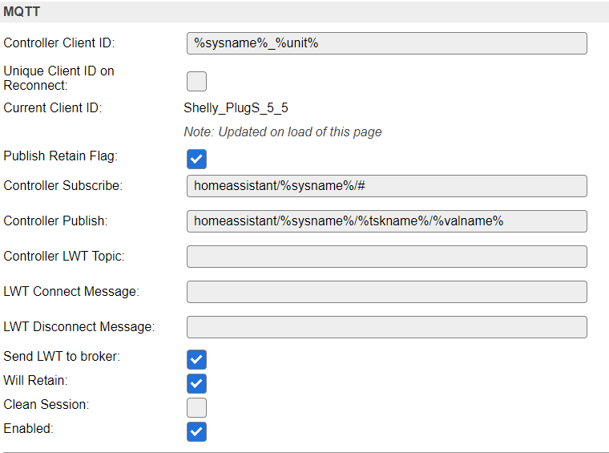

# NodeRED_ESPEASY_AutoDiscovery  
Flow to enable autodiscovery for EasyEsp without have the code on each device 

# Node-Red
* the Flow creates an device on Home assistant according to the name of the variable
* if a variable starts with "_" then its skipped

* Hint use MQTT Explorer to debug what is sent to Home Assistant if you have any problem

**Install Node-Red node:**

1. Copy [MQTTDiscovery.json](MQTTDiscovery.json) and import in Node-Red
2. Change/Update the MQTT nodes with correct security and other settings
3. Deploy it
4. run inject button Save List to create a starting point.


# EasyESP:  
Setup EasyESP:  
**Controller:**  


Controller Subscribe: EE/%sysname%/#

Controller Publish: EE/%sysname%/%tskname%/%valname%

Will Retain: True  

if the device needs to use MQTT import device then you need 2 mqtt controllers configurated the same  
but the first has to not have any username or password and can be disabled.  

Support | devices:  
--------|---------
Yes | Sensors 
Yes | Switch
Yes | RGB Led  
Yes | Dimmer 0-100  
Yes | Dimmer 0-255  
Not yet  | Termostat temperature output

**Sensorer:**
You only need to activate the device and set it to use the HA controller:


**Switch:**
create a dummy device and set the name of a value to include "Relay" or "Switch" as default  

add a new rule with the name Set%tskname% (exampel SetRelay if value is Relay)   
this rules job is to set the dummydevice and if needed GPIO  
Exampel:  
```
on SetRelay do
 taskvalueset,3,1,%eventvalue%
endon
```

**Dimmer:**
1. Create a dummy device 
2. Set a name of a value to include "Percent" or "Brightness"
3. Set one more to with prefix "_" example "_Percent" and set it to 0 Decimals
3. Create a MQTT import device
4. Set a name to the same as step 2 and one to State
5. set 1 Topic to the topic that step2 creates and add /Set
6. do the same for topic 2 but with /State
7. Add rules to copy values between them and run task if command is recived
(Exampel image both Devices)
```
on Import#Percentage do
 taskvalueset,2,1,%eventvalue%
 taskrun,2
endon
on Import#State do
 taskvalueset,2,3,[Import#State]
 if [Import#State]=1 then
  taskvalueset,2,1,[Import#Percentage]
 else
  taskvalueset,2,1,0
 endif
 taskrun,2
endon
```
**RGBDimmer**

**AdvanceSettings:**  
The Node-Red inject Node Settings containt settings if a Value name is a specific Device_Class and what unit(sufix) to use
