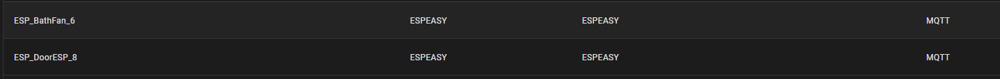

# NodeRED_ESPEASY_AutoDiscovery  
[Main Install](MainInstall.md)  
[Device Install](Devices.md)  
[Advance Settings](Advance.md)  

* The Flow creates an device on Home assistant according to the name of the variable
* Enable autodiscovery for EasyEsp without have the code on each device 
* If a variable starts with "_" then its skipped

* Hint use MQTT Explorer to debug what is sent to Home Assistant if you have any problem

 **Support** | **devices:** | **ValueNames** 
--------|---------|---------
Yes | Sensors | All other
Yes | Switch | State,Relay
Yes | RGB Led | RGBBrightness 
Yes | Dimmer 0-100 | Percent 
Yes | Dimmer 0-255 | Brightness 
Yes | Dimmer 0-240 | CounterTime
Yes  | Termostat temperature output | SetTemp(17-24), SetTime(0-24)
No | Selects
No | Buttons
No | Numbers

## Device list under configuration:

## Each device show all entitys that is connected to it.

plz tell if you miss any device from 
https://www.home-assistant.io/docs/mqtt/discovery/

