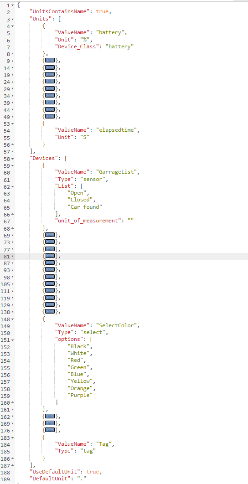

# NodeRED_ESPEASY_AutoDiscovery  
[Main Install](MainInstall.md)  
[Device Install](Devices.md)  
[Advance Settings](Advance.md)  

* The Flow creates an device on Home assistant according to the name of the variable
* Enable autodiscovery for EasyEsp without have the code on each device 
* If a variable starts with "_" then its skipped

* Hint use MQTT Explorer to debug what is sent to Home Assistant if you have any problem

## Device list under configuration:

## Each device show all entitys that is connected to it.

Support | devices:  
--------|---------
Yes | Sensors 
Yes | Switch
Yes | RGB Led  
Yes | Dimmer 0-100  
Yes | Dimmer 0-255  
Yes  | Termostat temperature output

plz tell if you miss any device from 
https://www.home-assistant.io/docs/mqtt/discovery/

